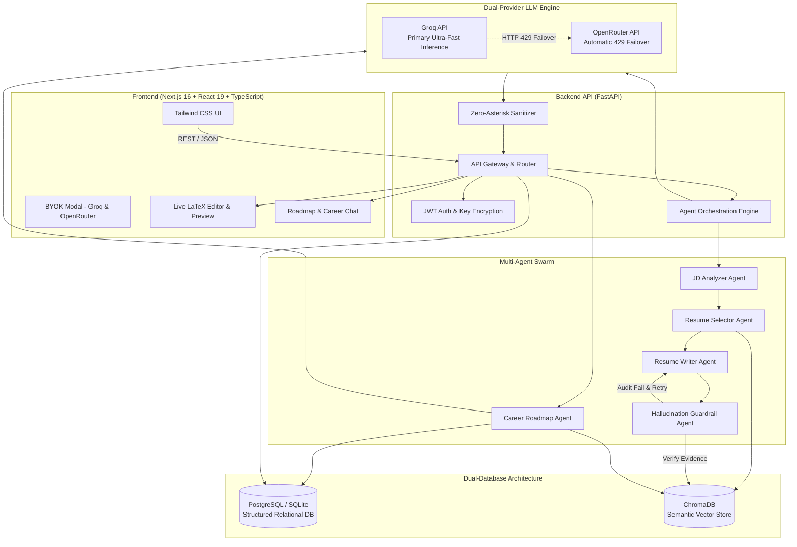

<div align="center">

# MatchResume

### Multi-Agent AI Resume Intelligence & Career Roadmap Engine

Grounded RAG &bull; Zero-Hallucination Guardrails &bull; ATS-Optimized LaTeX &bull; Dual LLM Failover &bull; Career Project Blueprints

[](https://nextjs.org/)
[](https://react.dev/)
[](https://www.typescriptlang.org/)
[](https://fastapi.tiangolo.com/)
[](https://python.org)
[](https://www.trychroma.com/)
[](https://www.postgresql.org/)
[](https://groq.com/)
[](https://openrouter.ai/)
[](https://opensource.org/licenses/MIT)

</div>

---

## Overview

**MatchResume** is a personal AI career intelligence system that eliminates the two biggest flaws of traditional AI resume builders: **hallucination** and **keyword stuffing**. 

Instead of generating generic, fabricated accomplishments, MatchResume indexes your actual career history, projects, and work experience into a semantic knowledge base. When given a target Job Description (JD), an orchestrated swarm of specialized AI agents analyzes the requirements, retrieves verified evidence, drafts ATS-optimized LaTeX resumes, and rigorously audits every generated claim against your source-of-truth ground truth.

Furthermore, when critical skill gaps are detected, MatchResume acts as a **Staff Software Architect & Career Strategist** to design production-grade project blueprints (system architecture, failure modes, modern tech stacks, quantifiable ATS bullets, and interview talking points) to help you decisively bridge the gap and land the role.

---

## Key Features

### 1. Orchestrated Multi-Agent Pipeline
- **JD Analyzer Agent**: Forensically breaks down target job descriptions into structured requirements, core responsibilities, must-have technologies, and seniority expectations.
- **Semantic Resume Selector Agent**: Queries the candidate's ChromaDB vector store to evaluate skill coverage and select the strongest historical resume foundation.
- **Resume Writer Agent**: Rewrites, prioritizes, and reorganizes accomplishments into high-density, ATS-friendly LaTeX code tailored directly to the target role.
- **Validator & Hallucination Guardrail Agent**: Cross-examines every bullet against the candidate's verified ground truth. Automatically flags or regenerates any unverified claims, fabricated companies, fake metrics, or unearned technologies.

### 2. Career Project Roadmaps & Gap Analysis (`/roadmap`)
- **Forensic Gap Analysis**: Evaluates your verified background against the job description to pinpoint missing skills, infrastructure challenges, and domain knowledge.
- **Production-Grade Blueprints**: Designs 2 comprehensive, real-world engineering project blueprints to prove competency. Each blueprint includes:
  - Real-World Problem Statement
  - Production Tech Stack (FastAPI, Redis, Kafka, ClickHouse, pgvector, etc.)
  - Core System Architecture & Failure Modes
  - Enterprise Realities (Tenant Isolation, Rate Limiting, Telemetry)
  - ATS Resume Bullets with Quantifiable Impact
  - Technical Interview Talking Points & Trade-off Discussions
- **30-Day Execution Roadmap**: Actionable Week 1 to Week 4 implementation milestones.
- **Persistent Chat Threads**: Real-time interactive follow-ups (schema designs, Docker compose files, edge-case analysis) backed by PostgreSQL.

### 3. Dual-Provider LLM Engine with Zero-Downtime Failover
- **Primary Provider (Groq)**: Ultra-low latency inference powered by `llama-3.3-70b-versatile` or `llama-3.1-8b-instant`.
- **Secondary Provider (OpenRouter)**: Automatic zero-downtime failover to OpenRouter (`meta-llama/llama-3.3-70b-instruct`) upon encountering HTTP 429 rate limits, token exhaustion, or provider downtime.
- **Zero-Asterisk Guarantee**: Built-in sanitization pipeline guarantees clean, executive-ready formatting without markdown asterisk noise (`*` or `**`).
- **High-Capacity Generation**: 6,000 token output ceiling with automated continuation logic to eliminate truncated responses.

### 4. LaTeX First-Class Generation
- **Native LaTeX Engine**: Resumes are generated in clean, ATS-compliant LaTeX rather than opaque binaries.
- **Live Preview & Editor**: In-browser code editing with real-time preview and instant PDF compilation.
- **Version Control**: Manage multiple targeted variations of your resume across different job applications.

### 5. Privacy & Bring Your Own Key (BYOK)
- **Zero Lock-In**: Provide your own Groq and OpenRouter API keys directly from the UI.
- **Secure Storage**: API keys are encrypted at rest using Fernet symmetric encryption.
- **Isolated Vector Spaces**: Candidate resumes, chunk embeddings, and application histories are strictly segregated per user.

---

## System Architecture



---

## Repository Structure

```text
matchresume/
├── backend/
│   ├── app/
│   │   ├── agents/               # LLM agents & orchestration logic
│   │   │   ├── groq_client.py    # Multi-provider client (Groq + OpenRouter failover)
│   │   │   ├── jd_analyzer.py    # Job description parser & requirement extractor
│   │   │   ├── resume_selector.py# Semantic resume matcher & score evaluator
│   │   │   ├── resume_writer.py  # ATS LaTeX resume generator
│   │   │   ├── validator.py      # Factual accuracy & anti-hallucination auditor
│   │   │   ├── roadmap_agent.py  # Project roadmap & forensic gap analysis agent
│   │   │   └── chat_agent.py     # Conversational resume refinement agent
│   │   ├── api/                  # FastAPI REST endpoints
│   │   │   ├── auth.py           # User authentication & BYOK key management
│   │   │   ├── resumes.py        # PDF ingestion, parsing & retrieval
│   │   │   ├── applications.py   # Job applications & tailored resume flows
│   │   │   ├── roadmap.py        # Project roadmap chat threads & messages
│   │   │   └── knowledge.py      # ChromaDB vector knowledge base queries
│   │   ├── db/                   # Database models & SQLAlchemy sessions
│   │   │   ├── models.py         # PostgreSQL schema (User, Resume, Roadmap, etc.)
│   │   │   └── session.py        # Connection pooling & session lifecycle
│   │   ├── utils/                # Text sanitizers, PDF extractors, encryption
│   │   ├── config.py             # Pydantic v2 settings & environment configuration
│   │   └── main.py               # FastAPI application entrypoint & middleware
│   ├── requirements.txt          # Python dependencies
│   └── .env.example              # Backend environment template
│
├── frontend/
│   ├── app/                      # Next.js 16 App Router pages
│   │   ├── applications/         # Job applications & tailoring workspace
│   │   ├── resumes/              # Resume library & PDF uploader
│   │   ├── roadmap/              # Project Roadmap & Gap Analysis chat UI
│   │   ├── knowledge/            # Semantic resume vector inspector
│   │   ├── layout.tsx            # Root layout, theme & authentication providers
│   │   └── page.tsx              # Landing page & feature showcase
│   ├── components/               # Modular UI components
│   │   ├── settings/BYOKModal.tsx# Dual-provider Groq & OpenRouter key manager
│   │   ├── resumes/              # Resume card & uploader components
│   │   └── ui/                   # Buttons, modals, badges, inputs
│   ├── context/                  # AuthContext, ModelContext, ThemeContext
│   ├── lib/                      # API client, TypeScript interfaces, utilities
│   ├── package.json              # Node.js dependencies & scripts
│   └── .env.example              # Frontend environment template
│
└── README.md                     # Project documentation
```

---

## Getting Started

### Prerequisites
- **Python**: 3.11 or higher
- **Node.js**: 18.17 or higher (Node 20+ recommended)
- **Package Managers**: `pip` and `npm` (or `pnpm` / `bun`)
- **API Keys**: A free [Groq API Key](https://console.groq.com/keys) (optional: [OpenRouter API Key](https://openrouter.ai/keys) for failover)

---

### 1. Backend Setup

```bash
# Navigate to the backend directory
cd backend

# Create and activate a Python virtual environment
# On Linux/macOS:
python3 -m venv venv
source venv/bin/activate

# On Windows:
python -m venv venv
venv\Scripts\activate

# Install dependencies
pip install -r requirements.txt

# Create your local environment configuration
cp .env.example .env
```

Edit `backend/.env` with your preferred settings:
```env
GROQ_API_KEY="gsk_..."
OPENROUTER_API_KEY="sk-or-v1-..."  # Optional failover key
DATABASE_URL="sqlite:///./matchresume.db"
```

Start the FastAPI server:
```bash
uvicorn app.main:app --host 0.0.0.0 --port 8000 --reload
```
The backend API will be available at **`http://localhost:8000`** (Interactive OpenAPI docs at `http://localhost:8000/docs`).

---

### 2. Frontend Setup

```bash
# Navigate to the frontend directory
cd frontend

# Install Node dependencies
npm install

# Create your local environment configuration
cp .env.example .env.local
```

Start the Next.js development server:
```bash
npm run dev
```

Open **`http://localhost:3000`** in your browser.

---

## Environment Configuration

### Backend (`backend/.env`)

| Variable | Type | Default | Description |
|---|---|---|---|
| `APP_NAME` | string | `Resume Copilot API` | Name of the API service |
| `DEBUG` | boolean | `True` | Debug and hot-reload toggle |
| `PORT` | integer | `8000` | Backend server port |
| `HOST` | string | `0.0.0.0` | Host bind address |
| `DATABASE_URL` | string | `sqlite:///./matchresume.db` | PostgreSQL or SQLite connection string |
| `CORS_ORIGINS` | list | `["http://localhost:3000"]` | Allowed frontend origins |
| `GROQ_API_KEY` | string | `""` | Primary Groq API Key |
| `GROQ_MODEL` | string | `llama-3.3-70b-versatile` | Model used for Groq inference |
| `OPENROUTER_API_KEY` | string | `""` | Secondary OpenRouter API Key (Failover) |
| `OPENROUTER_MODEL` | string | `meta-llama/llama-3.3-70b-instruct` | Model used for OpenRouter failover |
| `JWT_SECRET_KEY` | string | `matchresume-secret-key` | Secret key for signing JWT tokens |
| `ENCRYPTION_KEY` | string | `...` | Symmetric Fernet key for encrypting BYOK keys |
| `CHROMA_PERSIST_DIR` | string | `./chroma_data` | Directory for local ChromaDB vector storage |

### Frontend (`frontend/.env.local`)

| Variable | Type | Default | Description |
|---|---|---|---|
| `NEXT_PUBLIC_API_BASE_URL` | string | `http://localhost:8000` | Base URL pointing to the FastAPI backend |
| `NEXT_PUBLIC_SITE_URL` | string | `http://localhost:3000` | Canonical frontend domain |

---

## REST API Reference

| Method | Endpoint | Description |
|---|---|---|
| `GET` | `/health` | Service health status and RAG vector store check |
| `POST` | `/api/auth/register` | Register a new user account |
| `POST` | `/api/auth/login` | Authenticate user and receive JWT access token |
| `GET` | `/api/auth/keys` | Retrieve encrypted BYOK configuration status |
| `POST` | `/api/auth/keys` | Save custom Groq & OpenRouter API keys |
| `POST` | `/api/resumes/upload` | Upload PDF resume, extract text, chunk and index in ChromaDB |
| `GET` | `/api/resumes/` | List all indexed resumes for the authenticated user |
| `GET` | `/api/resumes/{id}` | Get structured details and extracted text of a resume |
| `DELETE` | `/api/resumes/{id}` | Remove resume and delete associated vector embeddings |
| `POST` | `/api/applications/` | Create a job application with target JD |
| `POST` | `/api/applications/{id}/tailor` | Run the multi-agent tailoring pipeline to generate LaTeX resume |
| `POST` | `/api/roadmap/` | Run forensic JD gap analysis and generate project blueprints |
| `GET` | `/api/roadmap/sessions` | List saved roadmap sessions and message counts |
| `GET` | `/api/roadmap/sessions/{id}` | Retrieve roadmap session messages and project blueprint history |
| `POST` | `/api/roadmap/sessions/{id}/messages` | Send an interactive follow-up question in a roadmap session |
| `DELETE` | `/api/roadmap/sessions/{id}` | Delete a roadmap session and conversation history |
| `POST` | `/api/knowledge/query` | Perform ad-hoc semantic similarity search across candidate vectors |

---

## Deployment

### Backend (Render / Railway / Docker)
A Dockerfile can be added or deploy directly using the native Python environment:
- **Build Command**: `pip install -r requirements.txt`
- **Start Command**: `uvicorn app.main:app --host 0.0.0.0 --port $PORT`
- **Environment Variables**: Add `DATABASE_URL`, `GROQ_API_KEY`, `OPENROUTER_API_KEY`, `JWT_SECRET_KEY`, and `ENCRYPTION_KEY`.

### Frontend (Vercel / Firebase)
- **Framework Preset**: Next.js
- **Build Command**: `npm run build`
- **Output Directory**: `.next`
- **Environment Variables**: Set `NEXT_PUBLIC_API_BASE_URL` to your production backend URL.

---

## License

Distributed under the **MIT License**. See `LICENSE` for more information.

---

<div align="center">
Built with ❤️ for ambitious software engineers and technical leaders.
</div>
